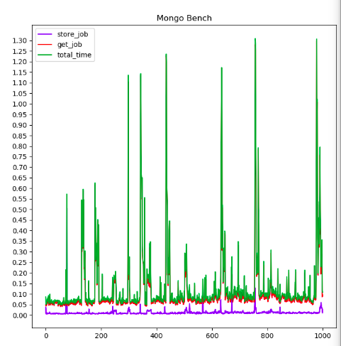
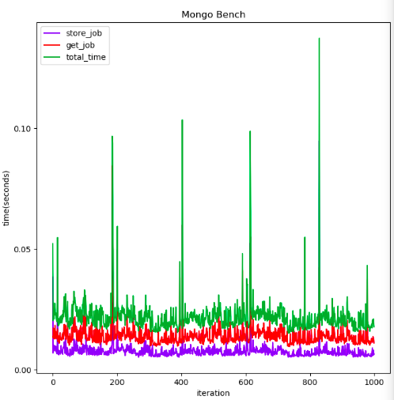

Currently On my mind
- json thing
- I will perform extensive benchmarks
- Json will work well with the gui
- JSON
	- Search
	- Easy to push
	- Same as the current xml implementation
	- Interaction with the database in another way (might expose the database maybe)
- Monitoring service
	- 2 services
- Handle copyable
- Update on each change of schema
- Loading should give same index
- Xml takes up space (json is only half the space and faster to parse)
- 
- Singularity:
	- Stream/Log
	- 
- Show example for each string representation method

### Project Proposal <br>Google Summer of Code 2020

# Upgrading the Ganga user interface to use a relational database for persistent storage

--------

## CERN-HSF 

------

Mentors:

- [Ulrik Egede](ulrik.egede@monash.edu)
- [Alex Richards](a.richards@imperial.ac.uk)
- [Mark Smith](mark.smith1@imperial.ac.uk)

**Ratin Kumar**<br>Email: ratin.kumar.2k@gmail.com<br>Phone: +91-9896225424

# Index

1. [Introduction](#Introduction)
2. [Synopsis](#Synopsis)
3. [Project Goals](#Project Goals)
4. [Implementation Details](#Implementation Details)
5. [Deliverables](#deliverables)
6. [Timeline](#Timeline)
7. [Working Schedule](##Working Schedule)
8. [References](#references)

# Introduction

## Personal Information

| Full Name | Ratin Kumar                                                  |
| --------- | ------------------------------------------------------------ |
| Institute | 2nd Year <br>B.Tech Student Computer Engineering<br>National Institute of Technology Kurukshetra |
| Email     | [ratin.kumar.2k@gmail.com](mailto:ratin.kumar.2k@gmail.com)<Br>[ratin_11822004@nitkkr.ac.in](mailto:ratin_11822004@nitkkr.ac.in) |
| Phone     | +91-9896225424                                               |
| Blog      | https://medium.com/@ratin.kumar.2k                           |
| Github    | https://github.com/DumbMachine                               |
| Skype     | Ratin Kumar                                                  |
| Timezone  | Indian Standard Time (GMT +0530)                             |
| Address   | 208, Hostel-6, <br>National Institute of Technology Kurukshetra,<br>Haryana, India -136119 |

## About Me

I am Ratin Kumar, a 2nd year undergraduate Computer Engineering student at National Institute of Technology Kurukshetra. I have experience in programming with multiple languages such as Python, C/C++, Java, JavaScript, with Python being my favorite. My major interests lie in the field of machine learning. My most significant work to date is a machine learning algorithm that extracts key frames from long videos and uses object locations from each key frame as a means to search frames from database of videos. A research paper detailing the specifics of this approach will be released soon. _Project Autonate_ is a tool I have been working on which will provide the world with an open source solution that helps bring automation to the mundane task of data annotation by actively learning from annotated data.

Besides programming, road cycling and stalking stocks are the hobbies that tack up most of my time.

### Why GSoC with CERN-HSF?

I have been always passionate about projects which link sciences with programming and this is the main inspiration for me to work with CERN. The idea of getting a chance to help scientists, who are influencing the future, really excites me and also aligns with my ambition to help humanity with the help of science and code.
Being able to analyze and perform operations on data is very important for it to be consumable and understandable. Thus being a part of Ganga and helping to increase the speed and optimize the operations would be really great.

### Preparation I have done:

- Completed the qualification task. The code resides [here](https://github.com/DumbMachine/GangaGsoc2020) (I'm aware that this link is currently private, I plan to make the repository public before deadline)
- I have run extensive tests to help me understand the project better and determine best techniques. For more information about it, refer to this [respository](https://github.com/DumbMachine/ganga-gsoc-2020) (I plan to make a edit readme file with details about my experiments and their outcomes/conclusions)

# Synopsis:

In experiments like LHC(Large Hadron Collider), a very large amount of data (in order of petabytes) is generated. This huge amount of data is then processed using a collection of powerful computers at multiple computing sites by distributing the data in small chunks and processing them individually at remote distributed computing network and then finally collecting the result. These multiple sites are interconnected by a grid. These type of Grids can be accessed by a toolkit called Ganga.

Ganga is an open source iPython based interface tool to the computing grid which leverage the power of distributed computing grid and provide scientists an interface supported by a powerful backend where they can submit their computation intensive programs to Ganga as a batch job. After submitting the job, Ganga processes the program somewhere on the grid, it keeps track of status of the job and after completion of job it gives back output to the user. It can also provide job statistics and job errors, if any.

The aim will be to create a new model, using a database system, that can serve as the persistent system for Ganga. It will support caching. This project seeks to build a persistent storage model that will scale well to the uses cases within science over the coming decade. A more responsive user interface that can transfer information to and from the persistent storage in a faster and more efficient way. A caching in memory that will allow Ganga to keep a fixed size in memory.

Singularity containers are the docker container counterparts in the world of High performance computing. This project aims to allow easy installation of database and cache system using singularity containers.

## Benefits to Community

This project will replace the old xml-based metadata system with a database, which will be assisted by a caching server, that will allow for a more responsive user interface. The containerized database will also allow for remote access to job metadata, provided user has access to the host of container. (ask for clarification from mentors here). The project will enhance the process of large scale computing of batch jobs at CERN and other similar organizations.

# Implementation Details

Currently ganga supports two methods of getting a string or file stream to convert to ganga job object:

- export/load method: This method convert a file stream containing string representation of ganga schema to a ganga job object (`GangaCore.GPIDev.Base.Proxy.Job`) 

  ```python
  # NOTE: The file is format to be compact
  #Ganga# File created by Ganga - Mon Mar  9 02:04:44 2020
  #Ganga#
  #Ganga# Object properties may be freely edited before reloading into Ganga
  #Ganga#
  #Ganga# Lines beginning #Ganga# are used to divide object definitions,
  #Ganga# and must not be deleted
  
  #Ganga# Job object (category: jobs)
   Job (
     name = '', comment = '',
     parallel_submit = True, do_auto_resubmit = False, inputsandbox =[],
     info =   JobInfo (monitor =None),
     application =   Executable (
       exe = File(name='count-word.sh',subdir='.'),
       args = [
           'page0.pdf',
            // .......
           'page11.pdf'
       ],
       env = {},
       platform = 'ANY',
       is_prepared = ShareDir(name='conf-779aac10-966e-47aa-8b59-5455e98dc9da',subdir='.'),
       hash = '3ee875b5e35c98a78ffdc9b49f0bfd05'
     ),
     backend =   Local (nice = 0, force_parallel = False),
     inputfiles =[    
       LocalFile (namePattern = 'page0.pdf', localDir = '', compressed = False),    
       // .......
        LocalFile (namePattern = 'page11.pdf', localDir = '', compressed = False)
     ],
     outputfiles =[    
       LocalFile (
         namePattern = 'result.txt', localDir = '', compressed = False
       )
     ],
     inputdata =None,
     splitter = ArgSplitter (
       args = [
           ['page0.pdf'],
            // .......
           ['page11.pdf']
       ]
     ),
     postprocessors =   MultiPostProcessor (),
     virtualization =None
   )
  
  ```

  

  (This is the slow method)

  (reason for being slow)

  \# link for [reference](https://github.com/ganga-devs/ganga/blob/80bc4d9a6b5cb45bd72647236a782808bb4364e2/ganga/GangaCore/GPIDev/Persistency/__init__.py#L203)

  for item in itemList:
      item = item.strip()
      if item:
          try:
              from GangaCore.GPIDev.Base.Proxy import getProxyInterface
              <span style="color:red">this_object = eval(str(item), getProxyInterface().__dict__)</span>
              objectList.append(this_object)
          except NameError as x:
              logger.exception(x)
              logger.warning("Unable to load object with definition %s" % item)
              logger.warning("Required plug-ins may not be available")

  

  (chart showing the slow speed, I will update the above chart to a better version tonight)

  On average the conversion task takes : `0.029319047927856445 seconds`

- `xml method` (`to_file/from_file method`): This method takes in a file stream consisting of job schema information in the form of xml. Implementation works by using a xml parser to iterate through all the attributes and assigning the appropriate attribute from the xml to the schema of an `EmptyGangaObject`. This method, though faster, is fragile and very specific. 

   (This is the fast method)
  
  On average the conversion task takes: `0.00010609626770019531 seconds`
  
  


```json
# job.json
{
    "outputsandbox": [],
    "comment": "",
    "id": 8,
    "status": "",
    "name": "",
    "inputdir": "/home/needshelp/gangadir/workspace/needshelp/LocalXML/8/input/",
    "outputdir": "/home/needshelp/gangadir/workspace/needshelp/LocalXML/8/output/",
    "do_auto_resubmit": "False",
    "parallel_submit": "True",
    "inputsandbox": [],
    "info": {
        "submit_counter": 0,
        "uuid": "",
        "monitoring_links": [],
        "monitor": "None"
    },
    "time": {
        "new": "2020/03/18 07:53:55",
        "backend_running": "2020/03/18 07:53:58",
        "running": "2020/03/18 07:53:58",
        "submitted": "2020/03/18 07:53:58",
        "submitting": "2020/03/18 07:53:58"
    },
    "application": {
        "exe": {
            "name": "count-word.sh",
            "subdir": "."
        },
        "args": [
            "page0.pdf",
				....
            "page11.pdf"
        ],
        "env": "{}",
        "platform": "ANY",
        "is_prepared": {
            "name": "conf-e5d9209c-0775-453c-a73d-fabc213b1885",
            "subdir": ".",
            "associated_files": {
                "_list": [],
                "_is_preparable": "False"
            }
        },
        "hash": "3ee875b5e35c98a78ffdc9b49f0bfd05"
    },
    "backend": {
        "id": -1,
        "exitcode": "None",
        "workdir": "",
        "actualCE": "",
        "nice": 0,
        "wrapper_pid": -1,
        "force_parallel": "False"
    },
    "inputfiles": [
        {
            "localDir": "",
            "subfiles": "",
            "compressed": "False",
            "namePattern": "page0.pdf"
        },
        //   ................
        {
            "localDir": "",
            "subfiles": "",
            "compressed": "False",
            "namePattern": "page11.pdf"
        }
    ],
    "outputfiles": {
        "localDir": "",
        "subfiles": "",
        "compressed": "False",
        "namePattern": "result.txt"
    },
    "non_copyable_outputfiles": "",
    "inputdata": "None",
    "outputdata": "None",
    "splitter": {
        "args": [
            {
                "_list": "page0.pdf",
                "_is_preparable": "False"
            },
            // ........
            {
                "_list": "page11.pdf",
                "_is_preparable": "False"
            }
        ]
    },
    "subjobs": "Registry Slice: jobs(8).subjobs (0 objects)",
    "postprocessors": [
        "MultiPostProcessor" # GangaCore.GPIDev.Adapters.IPostProcessor.MultiPostProcessor object at 0x7f7ca843a590
    ],
    "virtualization": "None",
    "metadata": {}
}
```

For more detailed comparison of the Job output representation from the above method refer to : https://github.com/DumbMachine/GangaGsoc2020/blob/master/proposal-related/format_differences.md

Initial Push to database: When the `Job` Object is initialized

Then on every change/update to the state of `Job` 

- A possible option is json.

# Project Goals

## Objectives

- Add support in *ganga* to save/retrieve job metadata from database instance running inside of a singularity container.
- Add support for usage of cache database, to allow efficient retrieval of data.
- Test the new database-based persistent storage.

## Tasks

1. Create database system for use in persistent storage

   - Design the model for data stored in the database.

   - Implement data saving and retrieval.

     - Implement functions to save job metadata in database.
       - Determine the most efficient way of converting job's metadata to string representation, allowing for efficient storage in the database.
       - Develop method to store the obtained string representation and save it in the database, using the database's apis.
       - Integrate the conversion strategy and storing method.

     - Implement functions to retrieve job metadata from database.
       - Determine the most efficient way of converting job's metadata, in string format, back to a ganga job object.
       - Develop method to retrieve job's metdata from database.
       - Integrate the retrieval and type conversion.

   - Test the new model on local backend

     - Test the new database system by performing set conversions and checking for correct output.
     - Perform tests for various corner cases that can arise.

   - Implement error handling mechanism

     - Intentional try to convert corrupted/incorrect job metadata to create proper logs and raise the appropriate errors.

   - Write comprehensive documentation for the code written in Task 1.

2. Create cache support for database

   - Design a model for LRU based cache to store metadata information and prevent trashing.
   - Implement the cache handler in ganga.

   - Test the cache for cases:
     - retrieval of new data
     - retrieval of data present in the cache
     - retrieval of data just removed from cache
   - Test the cache system.
   - Write comprehensive documentation for the code written in Task 2.

3. Combine Task 1 and Task 2

   - Combine database system with cache 
   - Host the system using singularity container, to allow easy installation of the system.
   - Test the saving/retrieval of data from ganga process to database instance inside of singularity container.

# Deliverables

- Database, accompanied with a cache, system for persistent storage.
- Singularity container support, allowing to host the database and cache system.
- Test suite, complete with `unit tests` and `integration tests` catering to any added or new changes to codebase.
- Detailed documentation regarding the new model.
- Migration tool to help existing users to migrate to the new model.

# Timeline

| Duration              | Task                                                         |
| --------------------- | ------------------------------------------------------------ |
| March 31              | **Deadline for submitting Project Proposal**                 |
| March 31 - April 27   | **Application Review Period**                                |
| April 27 - May 18     | **Official Community Bonding Period**                        |
| May 18 - June 12      | **Official Coding Period Start** **Begin Task 1:**<br>       |
| June 12 - June 15     | Time period for any unexpected delay.<Br> **Finish Task 1**  |
| June 15 - June 19     | **Phase 1 evaluation** <br>Submit git repository of Code with documentation for Task 1 |
| June 19 - July 10     | **Begin Task 2 : Implement Active Learning**<br>             |
| July 10 - July 13     | Time period for any unexpected delay. <br>**Finish Task 2**  |
| July 13 - July 17     | **Phase 2 evaluation**<br> Submit git repository of Code with documentation for Task 2 |
| July 17 - August 7    | **Begin Task 3 : Complete Integration** <br>                 |
| August 7 - August 10  | **Phase 3 evaluation**<br> Submit git repository of Code with documentation for Task 3 |
| August 10 - August 17 | **Finish Task 3** **Final Submission **Submit git repository of final code with complete documentation. |

## Additional Information Regarding Timeline

- The timeline gives a rough idea of my planned project work. Best efforts will be made to follow the proposed schedule. I believe that I will be able to achieve all the milestones for this as it aligns with my interest and trying to do something innovative.
- I’ve no other commitments during summer and hence, will be able to dedicate 48 hours to 60 hours a week. During the last month of the project, my college will begin and I’ll be denoting around 28-30 hours a week.
- Each week, time will be divided for implementation of features and documentation of these features. All the features and documentation will be written simultaneously (in the same week). I would like to spend weekdays on implementation and use weekends for testing, writing documentation and researching about the next weeks implementation.
- Weekends will be mostly dedicated to testing, bug fixing, and blog writing. Fortnightly blogs will be maintained at https://medium.com/@ratin.kumar.2k and will include highlights of the development process and also methods used to overcome hurdles.

## Working Schedule

I’ll be working full-time on the code on weekdays. On weekends, I’ll be focusing on documentation, testing and bug fixing. My awake hours would usually be in between 6:30 AM IST (1:00 AM UTC) to 2 AM IST the next day (8:30 PM UTC) and I’m comfortable working anytime during this period but I can easily tune my working hours if circumstances ask for it. Except for a few days of traveling (which I’ll be informing in advance to my mentor), I’ll be having no other absences. In case of emergencies, I'll be informing my mentor.

I'll be working from either my house or hostel, both the places have access to good internet. I’m very flexible with my schedule and timezone variation (with my mentor) won’t be an issue. I’m comfortable with any form of communication that suits my mentor.

## Future Prospects:

If selected I will continue to provide patches, bug fixes and support the project. 

# **References**:

This is a work in progress.

1. [GANGA Toolkit](http://ganga.web.cern.ch/ganga/)
2. [LHC](https://home.cern/topics/large-hadron-collider)
3. [GANGA GPI](https://ganga.readthedocs.io/en/latest/UserGuide/InstallAndBasicUsage.html)
4. Pymongo, Mongodb
5. Redis
6. Singularity