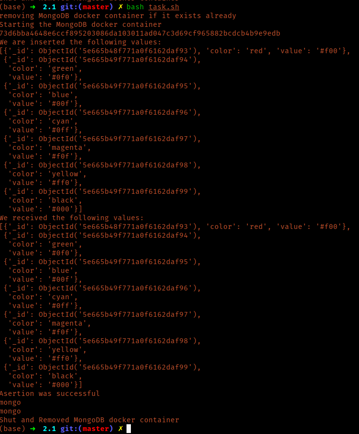
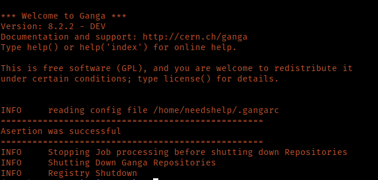

NOTE: If you wanna test that all the code is working, I recommend you to run the following:

```bash
$ start the necessary docker containers
$ cd tests
$ pytest test_task1.py test_job.py
```

This will run all the tests and ensure everything is working fine.

# Ganga persistent storage task


1. Demonstrate that you can create a simple database where the server runs on the local machine. Demonstrate that you can read/write to the database from within python. The database backend has to be an open source solution but otherwise the choice of technology is up to you. Make sure to provide instructions on how to set up the database.

    **Solution**: To demonstrate the creation and usage (r/w) of database, make sure you have the following:
           1. `docker` installed on your system.
        2. `pymongo` python package. (`pip install pymongo`).
        3. `singularity` installed on your system. (`this is optional, having docker would do the same`)

    Run the following:
    ```bash
    $ cd task2/2.1
    $ bash task.sh
    ```

    The output would look like:

    

2. Now take the Ganga Job object created in the first exercise and store this as a simple blob in the database. You might find the functions export and load that is available at the Ganga prompt useful. You can either use a file as an in-between point or you can look at how the export and load functions are implemented. You can find the code in https://github.com/ganga-devs/ganga/blob/develop/ganga/GangaCore/GPIDev/Persistency/__init__.py. Demonstrate that you can read the blob back and re-create a job object.

    **Solution**: I have mentioned details about the implementation below. To display my ability to read the blob back and re-create a job object, refer to this `task2/2.2/read_write_job.py`.
    
    Here I have attached screenshot from running the script by 
    
    `ganga read_write_job.py`.
    
    
    
3. Measure the performance of reading the blob from the database and  re-create the job object a thousand times. Measure the time spent reading the blob from the database separately from the time it takes to  recreate the job objects. The emphasis should be on that you can measure the times not on optimizing how fast it is.

    **Solution**: I have used 3 methods here:

    - `full_print` method: This method makes use of the `full_print` function provided in `ganga cli`. Below I have mentioned how the solution for this was implemented:
      - Suppose we have a job `j`. 
      - `POST Cycle`(sending job to db):
        - `full_print(j)` will print the `j`'s string representation to the stdout.
        - The output to stdout is captured and saved in a string.
        - That string is then sent to the database with an identifier `jid`, job id.
      - `GET Cycle`(retrieving from the db):
        - The db is asked for a job using the `jid` identifier.
        - The `string representation` of the `job` is stored in a string.
      
    - `export/load` method: This method makes use of the `export` and `load ` functions provided in the `ganga cli`.
      
      - Suppose we have a job `j`.
      - `POST Cycle`(sending job to db):
        - `export(j, <file_name>)`, this function call will write the `string_rep` of the job to file <file_name>. 
        - I have written a function `custom_export`, which is the same function as the `export` function, but with a difference that instead of storing the `string_rep` to a file it returns it.
        - Once `custom_export` functions gives the `string_rep` of the job, it is sent to the database.
      - `GET Cycle`(getting job from db):
        - `load(<filename>)` function call reads a job's `string_rep` to create a `GangaCore.GPIDev.Base.Proxy.Job` Object.
        - I wrote a `custom_load` which, again, is the same as the one already implemented but with the difference of creating a `GangaCore.GPIDev.Base.Proxy.Job` Object from a `string_rep` variable.
        - The db is asked for a job using the `jid` identifier and loaded using `custom_load`.
      
    - `from_file/to_file` method: This method uses the aforementioned functions from the VStreamer.py file:

      - Much like the previous functions, I have made very small tweaks to make use of these functions to serve my purpose of :
        - Taking a ganga `job` and converting it into its `string_rep` for better storage.
        - Taking the `string_rep` and converting it back to ganga `job`.

      **Running** the solution:

      - `full_print`: To run this solution:

        ```bash
        # this bash file will start the docker containers for the required databases and call the stress test on them.
        % bash full_print.sh
        ```

      - `export/load`: To run this solution:

        ```bash
        # this bash file will start the docker containers for the required databases and call the stress test on them.
        % bash export_load.sh
        ```

      - `from_file/to_file`: To run this solution:

        ```bash
        # this bash file will start the docker containers for the required databases and call the stress test on them.
        % bash xml_way.sh
        ```

This file is already long, I have attached some of the images, plots and other explanation to Project.md

 