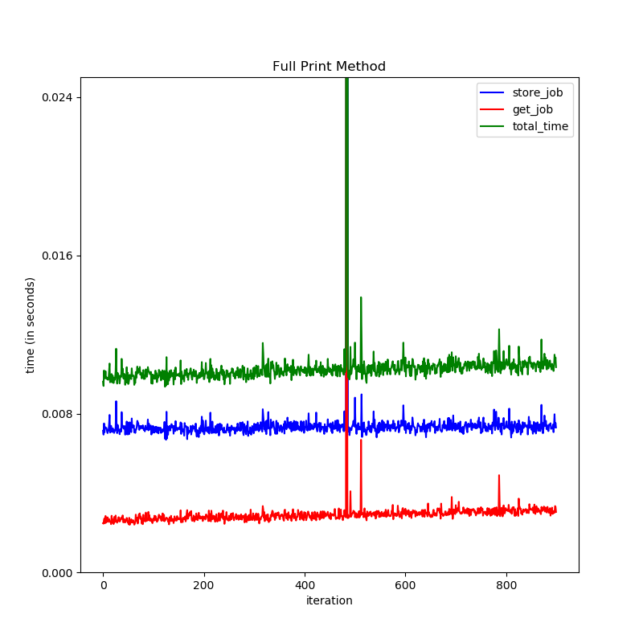
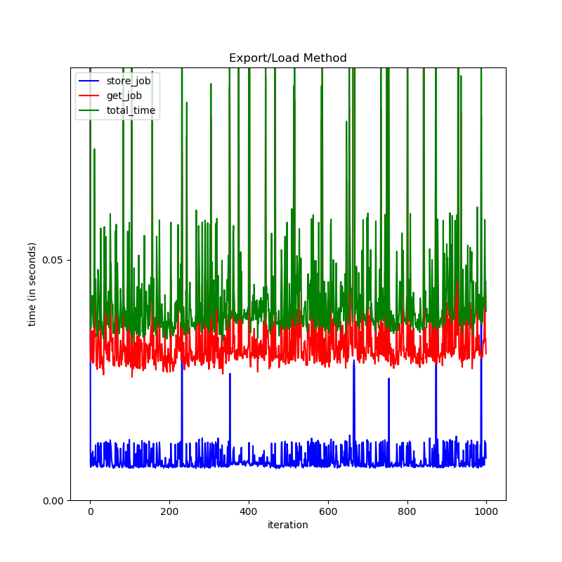
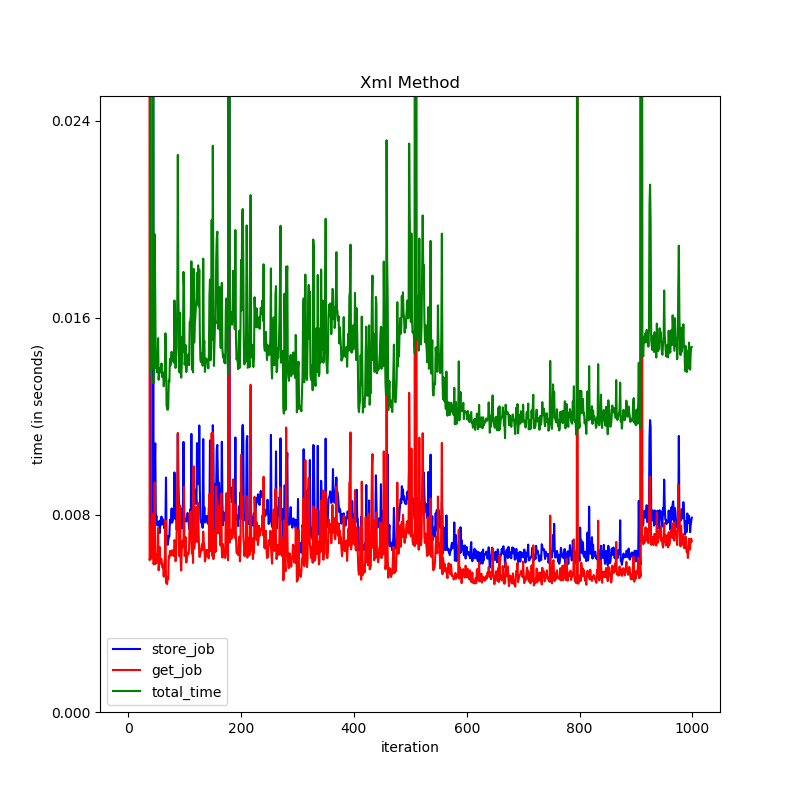

The below section deals with graphs and possible explanations of results obtained after bench marking 5 different databases. The code used to benchmark databases, can be found here. 

# Plots for Database Comparison:

1. Comparison of `MongoDB` and `PostgreSQL` for storing a ganga job metadata:

   

2. Comparison of the Resources used by `MongoDB` and `Postgres` docker instance:

   NOTE: The reference sections for `postgres` graphs are longer as it took more time to perform the same tasks)

   The information was captured using this scripts that can be found [here](https://github.com/DumbMachine/GangaGsoc2020/tree/master/src/bench) :

   

   

# Plots for Job Conversion Methods Comparison:

NOTE: `full_print` method by itself isn't viable but is included as it was asked fore in the early edit of Qualification Task for this project.

